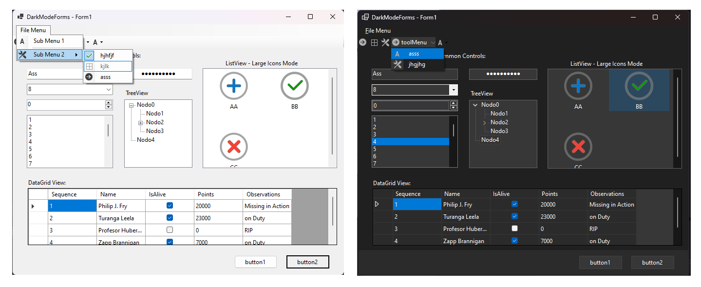
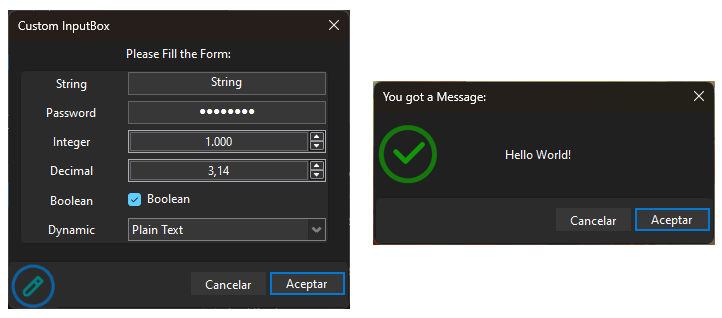
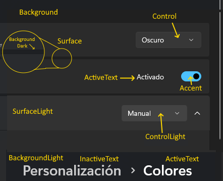

# Dark-Mode-Forms

Apply Dark Mode to all Controls in a Form [WinForms]



- This will detect if dark mode color is enabled in Windows settings.
- Then iterate all the controls on your form and try to convert them to DarkMode (if enabled).
- [Optional] If you have icons on your menus or toolbars, they will be recolored to give you a lighter, more visible-in-the-dark version of your icons. (Works best with monochrome icons)
- You can access Windows Dark Colors and use them for whatever you need.

## Now with Dark Messenger

Window's default MessageBox cant not be themed, so Added a [Messenger.cs](SourceFiles/Messenger.cs) class that allowes the user to popup Messages and InputBoxes:

- ```Messenger.MessageBox``` is a Direct replacement for the old ```MessageBox.Show```, the new one applies Windows's Dark Mode automaticaly.
- ```Messenger.InputBox``` is a replacement for VisualBasic's InputBox, implemented for C# and with extended functionalities:
  - In its simplies form, you ask the user for a Text Input, then you use that for whatever you need
  - But Messenger.InputBox allowes you to promt the user with many more 'Fields' of different types:

- Button Texts are automatically translated to 7 Languages: ```en, es, de, fr, ru, kr, zh```.
- DarkMode doesnt require the Messenger but Messenger does require DarkMode.

MessageBox:

```csharp
try
{
   if (Messenger.MessageBox("Hello World!", "You got a Message:",
       MessageBoxButtons.OKCancel, MessageBoxIcon.Exclamation) == DialogResult.OK)
   {
      //Do Something here.
   }
}
catch (Exception ex)
{
   Messenger.MessageBox(ex);
}
```

InputBox:

```csharp
// Definition of a Single Field:
var BoolControl = new KeyValue("Boolean", "true", KeyValue.ValueTypes.Boolean);

// Can Validate User Inputs on the Field:
BoolControl.Validate += (object? _control, KeyValue.ValidateEventArgs _e) =>
{
   string OldValue = _e.OldValue;
   if (_e.NewValue == "False")
   {
      //_e.Cancel = true; //<- CAN CANCEL THE MODIFICATION
      _e.ErrorText = "No puede ser Falso!";
   }
};

// Custom Values for 'Dynamic' Fields:
List<KeyValue> Dtypes = new List<KeyValue>
{
   new KeyValue("RichText Format", "0"),
   new KeyValue("Plain Text",      "1"),
   new KeyValue("AccountManager",  "2")
};

// Definition of Multiple Fields:
List<KeyValue> _Fields = new List<KeyValue>
{
   new KeyValue("String",  "String",   KeyValue.ValueTypes.String),
   new KeyValue("Password","Password", KeyValue.ValueTypes.Password),
   new KeyValue("Integer", "1000",     KeyValue.ValueTypes.Integer),
   new KeyValue("Decimal", "3,141638", KeyValue.ValueTypes.Decimal),
   BoolControl,
   new KeyValue("Dynamic", "1",        KeyValue.ValueTypes.Dynamic, Dtypes),
};

// Dialog Show:
if (Messenger.InputBox("Custom InputBox", "Please Fill the Form:", ref _Fields,
    MsgIcon.Edit, MessageBoxButtons.OKCancel) == DialogResult.OK)
{
   Debug.WriteLine(string.Format("The New Password is: '{0}'", _Fields[0].Value));
}
```

Example of a LoginForm with Password Validation:


```csharp
List<KeyValue> _Fields = new List<KeyValue>
{
   new KeyValue("User Name", "user", KeyValue.ValueTypes.String),
   new KeyValue("Password",  string.Empty, KeyValue.ValueTypes.Password)
};

// Can Validate All the Controls before Closing the Dialog:
Messenger.ValidateControls += (object? sender, CancelEventArgs e) =>
{
   string _userName = _Fields[0].Value;
   string _password = _Fields[1].Value;

   //TODO: Here you should send the User/Password to your BackEnd for Validation
   if (_password != "password")
   {
      _Fields[1].ErrorText = "Incorrect Password!";
      e.Cancel = true; //<- Prevents the Dialog to be closed until is valid
   }
};

// Dialog Show:
if (Messenger.InputBox("Login", "Please Input your Credentials:", ref _Fields,
 MsgIcon.Lock, MessageBoxButtons.OKCancel) == DialogResult.OK)
{
   Messenger.MessageBox(string.Format("The User '{0}' is Logged!", _Fields[0].Value), "Login Correct!",
      MessageBoxButtons.OK, MessageBoxIcon.Exclamation);
}
```

## Implementation

- No Nuggets, No external DLLs, Just 1 File: [DarkModeCS.cs](SourceFiles/DarkModeCS.cs) Copy/Paste or [Download](https://github.com/BlueMystical/Dark-Mode-Forms/releases/latest) and import it into your project.
- 1 Line to implement it:

```csharp
public Form1()
{
   InitializeComponent();
   _ = new DarkModeCS(this); //<- Line of code here
}
```

## Dark Mode Colors



## Framework Compatibility

- .NET 4.8+
- .NET 6.0+
- Some stuff may only work on Windows 11+
- VS 2022+

## Limitations

There are a few Winforms Controls that are, by design, extremely hard to theme:

- ComboBox:   Borders & Dropdown Button look too white.  You could use [FlatComboBox](SourceFiles/FlatComboBox.cs) instead, check in the Example.
- TabControl: 90% themed, a white border around the selected tab still remains.  You could use [FlatTabControl](SourceFiles/FlatTabControl.cs) instead, check in the Example.
- MessageBox:  Can't be themed. You can use [Messenger](SourceFiles/Messenger.cs) instead.
- DateTimePicker: Un-themed.
- MonthCalendar:  Un-themed.
- ProgressBar:    Un-themed. You can use [FlatProgressBar](SourceFiles/FlatProgressBar.cs) instead.

[Buy me a Coffe](https://buymeacoffee.com/blue.mystic)
